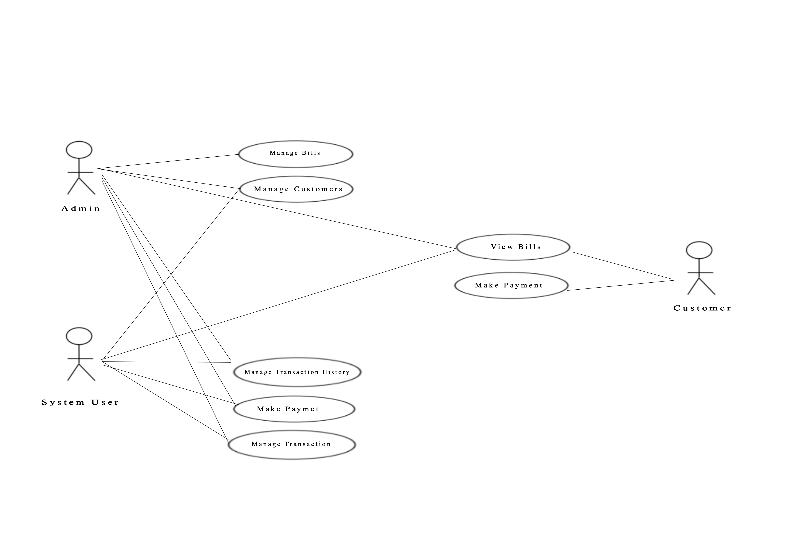

# Medical Billing System

## 📌 Overview
This project utilizes Python's GUI capabilities to develop a user-friendly **Inventory and Billing System**. Through a sleek graphical interface, users can efficiently manage inventory items, check the availability of medicines stored in a local database, and seamlessly generate bills for purchases. This system ensures accurate billing, reduces manual errors, and streamlines the healthcare billing workflow.

## 🚀 Key Features
- **User-Friendly GUI**: Intuitive graphical interface for easy navigation.
- **Inventory Management**: Add, update, and delete medicine stock.
- **Medicine Availability Check**: Quickly verify stock levels from the local database.
- **Automated Billing**: Generates invoices based on purchases.
- **Transaction History**: Maintains logs of all financial activities.
- **Batch and Expiry Tracking**: Ensures proper inventory management.
- **Payment Tracking**: Monitors outstanding payments and due amounts.

## 📅 Timeline & Evolution
- **Traditional Billing**: Manual record-keeping and handwritten invoices.
- **Digital Billing Systems**: Introduction of automated software for billing.
- **Modern Enhancements**: AI-driven predictions, cloud-based billing, and real-time inventory tracking.

## 📂 Project Modules
1. **Inventory Management**: Handles medicine stock, batch details, and expiry dates.
2. **Billing & Invoicing**: Generates invoices for customers with itemized details.
3. **Transaction & Payment Tracking**: Logs transactions and monitors outstanding payments.
4. **User Authentication**: Secure access to the system for authorized users.

## 🔮 Future Enhancements
- **AI-Based Cost Estimation**: Predicts total billing amounts based on customer purchase patterns.
- **Cloud-Based Storage**: Allows remote access and multi-location billing.
- **Barcode Scanning Integration**: Speeds up inventory and billing processes.
- **Multi-Payment Gateway Support**: Expands payment options for users.

## 📷 Use Case Diagram

## 🎯 Applications
- **Pharmacies** – Efficient medicine stock and invoice management.
- **Hospitals & Clinics** – Automated patient billing and record-keeping.
- **Medical Stores** – Easy stock tracking and sales management.
- **Healthcare Suppliers** – Bulk inventory handling with automated transactions.

## 💡 Technologies Used
- **Frontend**: Tkinter for GUI-based application.
- **Database**: SQLite/MySQL for local data storage.
- **Security**: User authentication for secure access.

## 🤝 Contribution
Feel free to contribute to this project! Follow these steps:
1. Fork the repository.
2. Create a new branch.
3. Make your changes.
4. Submit a pull request.

## 📞 Contact
For any inquiries, reach out via [revanthdrampal@gmail.com](mailto:revanthdrampal@gmail.com).

---
**Thank You!** 🎉

